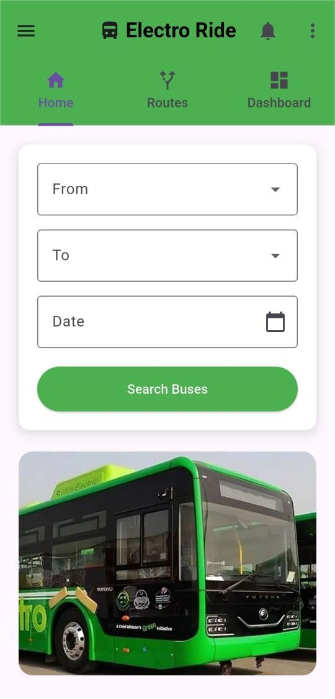

# ElectroRide 🚍⚡

ElectroRide is a mobile ticket booking application developed for the CM Punjab Bus Scheme.
The app allows users to easily book tickets, manage rides, and access transportation services digitally.

## Features
- User registration & login
- Ticket booking system
- Ride history
- Clean and user-friendly UI

## Tech Stack
- Flutter / Dart
- Android Studio
- Supabase 
- REST APIs

## Project Purpose
This project was developed as a semester project to address real-world public transport challenges using mobile application development.

## Future Enhancements
- Online payment integration
- Admin dashboard
- Real-time bus tracking

- ## Screenshots

### Login Screen

### Home Screen

### Booking Screen

